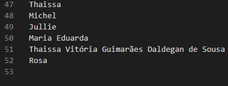
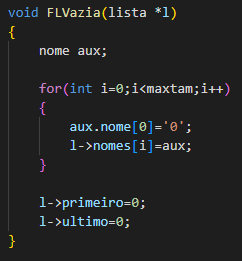

<h1>Exercício 2</h1>
<h2>Proposta:</h2>

 Crie uma lista linear que consiga armazenar um conjunto de 100 nomes quaisquer, os quis serão salvos de forma aleatória. Feito a estrutura, crie as seguintes ações:

<ul>
  <li>Uma função que consiga identificar replicações na lista, ou seja, nomes iguais. Remova todas as réplicas sem mover os "ponteiros"</li>
  <li>Como você gerenciaria os espaços em branco para novas inserções? Qual seria o custo dessas novas inserções?</li>
  </ul>
 <h2>Desenvolvimento:</h2>
 
O primeiro passo é criar ou anexar a pasta um arquivo .txt que cotenha os nomes que serão lidos. Para que o programa execute sem problemas, é necessário que coloque-se uma linha em branco extra após o fim dos nomes, assim como no exemplo da foto abaixo:

 

Após o comando para executar(make run), o programa cria uma lista e preenche todas as primeiras posições(posição 0) do vetor de caracteres nome que está armazenado dentro do vetor nomes.

Esse preenchimento será útil para o procedimento de remoção de nomes iguais posteriormente.

 Então, o programa chama uma função que copia os nomes do arquivo "nomes.txt" para a lista inicializada anteriormente e imprime a lista após o fim das inserções.

O processo de impressão confere se o primeiro caracter do nome é diferente de "0", se for, ele mostra a string para o usuário.

No próximo passo, o programa chama um função que percorre o vetor de nomes presentes na lista e se encontra algum repetido, seta a primeira posição do seu vetor de caracteres nome para "0", o que o faz ser "excluído" do vetor nomes(ele apenas não aparecerá na próxima impressão, que ocorre logo após,m).

Por último, o programa imprime novamente usando o critério citado anteriormente.

<h2>Questões:</h2>
<ol>
<li>
<dl>
<dt>Como você gerenciaria os espaços em branco para as novas inserções?</dt>
<dd> Seria basicamente o mesmo processo da impressão, se a primeira posição de algum dos vetores de caracteres "nome", presentes no vetor "nomes" da lista, fosse igual a "0", a inserção poderia ser realizada.</dd>
</dl>
</li>
    
<li>
<dl>
<dt>Qual seria o custo dessas novas inserções?</dt>
<dd>No caso do código, o custo seria o de percorrer o vetor de nomes, ou seja, n.</dd>
</dl>
</li>
</ol>

<h2>Compilação e Execução:</h2>

A lista linear disponibilizada possui um arquivo makefile que realiza todo o procedimento de compilação e execução. Para tanto, as seguintes diretrizes devem ser executadas em ordem:

<table>
<tr>
<th>Comando</th>
<th>Função</th>
</tr>
  
<tr>
<td><i>make clean</i></td>
<td>Apaga a última compilação realizada contida na pasta build</td>
</tr>
  
<tr>
<td><i>make</i></td>
<td>Executa a compilação do programa utilizando o gcc, e o resultado vai para a pasta build</td>
</tr>
  
<tr>
<td><i>make run</i></td>
<td>Executa o programa da pasta build após a realização da compilação</td>
</tr>
